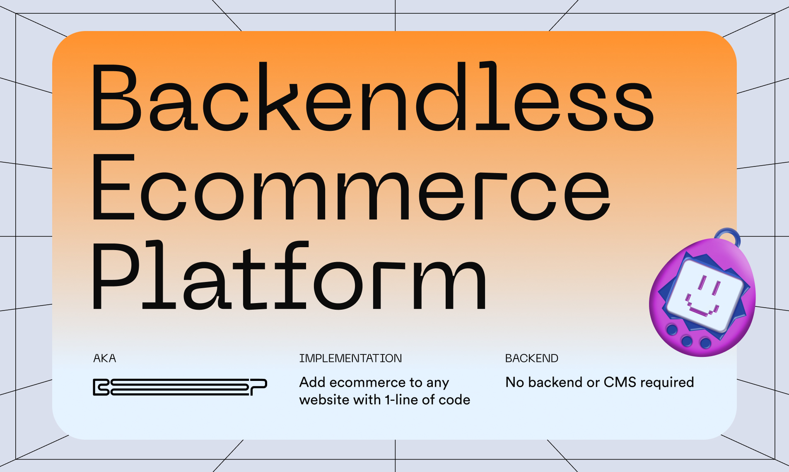

# Backendless Ecommerce Platform



## Table of Contents

- [Overview](#overview)
- [Getting Started](#getting-started)
- [Setup](#setup)
  - [Javascript SDK](#javascript-sdk)
  - [Basic Installation](#basic-installation)
    - [data-dola-buynow](#data-dola-buynow)
    - [data-dola-cart](#data-dola-cart)
    - [data-dola-cartaction](#data-dola-cartaction)
- [Zapier Integration](#zapier-integration)
  - [Triggers](#triggers)
  - [Actions](#actions)
- [Reference](#reference)
- [Browser Compatibility](#browser-compatibility)
- [Contribute](#contribute)
- [License](#license)

## Overview

BEP is short for “Backendless Ecommerce Platform,” and it turns any website into a shop with just one line of code.

The best part?

BEP doesn't require a backend or CMS! Just add our snippet and you're in business _- literally!_

With BEP, you can instantly accept payments from 195 countries, ship globally, get paid, and it's free _- standard 2.9% + $0.30 processing fees apply._

Whether you're building a direct-to-consumer site, a landing page for your latest drop, or a side hustle with friends and family, BEP does it all.

Also, as orders come in, BEP provides you with everything you need to fulfill, including pre-paid duties, shipping, taxes, and more. BEP also comes with an API, accessible via API keys and a Zapier app, enabling you to build automations and sync data that's relevant to your business.

For now, BEP is available for merchants in the U.S. and U.K.; but, consumers everywhere can purchase from a BEP store.

To get started, reference the documentation below to add BEP to any static site.

[Demo Site](https://bep-example.dola.me/)

## Getting Started

1. Login to [Dola](https://dola.me).

2. Navigate to settings and click on `Become a merchant` and go through the onboarding process. Make sure that the `Website URL` field matches your website.

3. When setting up, depending on your use case, you can select the `Basic Installation` or `Javascript SDK` option. Paste the copied snippet in the `<head>` section of your base html file.

## Setup

### Basic Installation

There are 3 HTML data attributes that trigger actions. Each action attribute is used alongside other attributes that describe the product/cart details.

#### `data-dola-buynow`

When set to `"true"`, the element, when clicked, will trigger a checkout with the product information on that element.

```html
<div>
  <button
    data-dola-buynow="true"
    data-dola-quantity="1"
    data-dola-title="productName"
    data-dola-image="imageURL"
    data-dola-price="35000"
    data-dola-weight="3000"
    data-dola-sku="productsku"
    data-dola-id="uniqueProductId"
    data-dola-currency="USD"
    class="dola-dola-bills-yall"
  >
    Buy Now
  </button>
</div>
```

#### `data-dola-cart`

When set to `"true"`, this indicates that the product (represented by the other data attributes on that element) has been added to a shopping cart.

```html
<div
  class="dola-dola-bills-yall"
  data-dola-title="currentProductTitle"
  data-dola-title="productName"
  data-dola-image="imageURL"
  data-dola-price="35000"
  data-dola-weight="3000"
  data-dola-sku="productsku"
  data-dola-id="uniqueProductId"
  data-dola-currency="USD"
  data-dola-cart="true"
  data-dola-quantity="2"
>
  Checkout
</div>
```

#### `data-dola-cartaction`

When set to `"true"`, the element, when clicked, will trigger a checkout with all products that have been added to the cart (by having their `data-dola-cart` attribute set to `"true"`).

```html
<div>
  <button data-dola-currency="USD" data-dola-cartaction="true" class="dola-dola-bills-yall">
    Checkout
  </button>
</div>
```

Only 1 action type should be used on an element at a given time.

While BEP is loading, `dola-bep-loading` is added as a class to actionable HTML elements. This can be leveraged to implement styles and other behavior for the loading state.

### JavaScript SDK

Here's a basic example:

```js
const cart = {
  currency: 'USD',
  items: [
    {
      id: 'randomId',
      image: 'https://linkToproductimage',
      quantity: 1,
      title: 'sample product',
      price: 35000,
      grams: 543,
      sku: 'randomproductsku',
      subTotal: 35000,
    },
  ],
};

window.Dolapay.attachDola(cart, cb);
```

The `attachDola` method triggers an instance of Dola's 1-click Checkout. It accepts a cart object and a callback which fires in the case of a successful execution. Note, errors are handled by Dola.

## Zapier Integration

In order to automate post-purchase activities such as customer support, fulfillment, marketing, and more, we've integrated Dola with Zapier.

> To get started with setting up this integration, all you'll require is a [Zapier account](https://zapier.com/).

After setting up your account, navigate to [Dola's Zapier Integration page](https://zapier.com/apps/dola/integrations). Here, you can select from Dola's existing workflows or choose to build a custom workflow zap for yourself.

Dola's Zapier integration includes:

### Triggers

`New Order`: This trigger fires when a new order has been created for the merchant. It returns details about newly created order that are necessary to create fulfilment details.

### Actions

`Update Order`: This is an action that is fired to update a specific order's details.

## Order API

Manage orders using Dola's REST API. [View specification](https://docs.dola.me/#order-api-specification).

## Reference

### Basic Installation

These are the custom data attributes supported by BEP, these attributes are used to describe product/cart details depending on the attached action attribute.

| Attribute               | Description                                                                                                                                                |
| ----------------------- | ---------------------------------------------------------------------------------------------------------------------------------------------------------- |
| `data-dola-title`       | Required. It captures the name of the product.                                                                                                             |
| `data-dola-quantity`    | Required. It captures the quantity of the product being purchased.                                                                                         |
| `data-dola-image`       | Required. It refers to a the image for the product. It accepts a url string.                                                                               |
| `data-dola-price`       | Required. It captures the price of the product.                                                                                                            |
| `data-dola-weight`      | Required. It captures the weight of the product. Adjust for the quantity of product being purchased.                                                       |
| `data-dola-totalprice`  | Optional. It captures the total price of cart items, it is only used in a `cartaction` to describe the price total of all products in the cart.            |
| `data-dola-totalweight` | Optional. It captures the total weight of cart items, it is only used in a `cartaction` to describe the total weight of all products in the cart in grams. |
| `data-dola-id`          | Required. It refers to the unique id of this product.                                                                                                      |
| `data-dola-sku`         | Required. It refers to your sku for the product.                                                                                                           |
| `data-dola-currency`    | Required. It sets the currency you want payments in.                                                                                                       |
| `data-dola-variant-*`   | Optional. It is used to set variants, where `*` is replaced by the name of the variant.                                                                    |

There is support for `Simple` and `Complex` type products.

- `Simple`: This is a product that has no variants. Below is an example of a simple product.

  ```html
  <div>
    <button
      class="window.Dolapay.id"
      data-dola-buynow="true"
      data-dola-quantity="1"
      data-dola-title="productName"
      data-dola-image="imageURL"
      data-dola-price="35000"
      data-dola-weight="3000"
      data-dola-sku="productsku"
      data-dola-id="uniqueProductId"
      data-dola-currency="USD"
    >
      Buy Now
    </button>
  </div>
  ```

- `Complex`: This refers to a product that has variants. Custom variants can be added with the `data-dola-variant-*` attribute. Below is an example of a complex product.

  ```html
  <div>
    <button
      data-dola-buynow="true"
      data-dola-quantity="1"
      data-dola-title="productName"
      data-dola-image="imageURL"
      data-dola-price="35000"
      data-dola-weight="3000"
      data-dola-sku="productsku"
      data-dola-id="uniqueProductId"
      data-dola-currency="USD"
      data-dola-variant-color="red"
      class="window.Dolapay.id"
    >
      Buy Now
    </button>
  </div>
  ```

### JavaScript SDK

The script snippet initialises Dola and attaches a global `Dolapay` object to the global `Window` object. The global Dolapay object can be accessed via `window.Dolapay`.

```ts
interface IDolapay {
  id: string;
  attachDola?: (cart: Cart, callback: () => void) => void;
  type?: string;
  orderCompleted: boolean;
}


window.Dolapay:IDolapay
```

- `type`: This property refers to the initialization method of the BEP instance.

  - `basic`: means the BEP instance was created as a `JavaScript SDK` instance.
  - `custom`: means the BEP instance was created as an `Basic Installation` instance.

- `orderCompleted`: This property exposes the state of the current order.

- `id`: This property refers to your `merchantId` it is included in the script snippet copied from the developers section of your profile settings.

- `attachDola`: This method triggers an instance of Dola's 1-click Checkout. It accepts a `Cart` object and a callback which fires in the case of a successful execution. Errors are visually handled by Dola's 1-click Checkout.

  ```ts
  interface Cart {
    currency: string;
    items: CartItem[];
  }

  interface CartItem {
    id: string;
    image: string;
    quantity: number;
    title: string;
    price: number;
    grams: number;
    variantInfo?: VariantInfo[];
    sku?: string;
    subTotal: number;
  }

  interface VariantInfo {
    id: string;
    name: string;
    value: string;
  }
  ```

## Browser Compatibility

- last 2 Chrome versions
- last 2 Firefox versions
- last 2 Edge versions
- modern browsers

## Contribute

If you like the idea behind BEP and want to become a contributor - do not hesitate and check our list of the active issues or contact us directly via bep@dola.me.

If you have discovered a :ant: or have a feature suggestion, feel free to create an issue on Github.

## License

BEP source code is completely free and released under the [MIT License](LICENSE).
