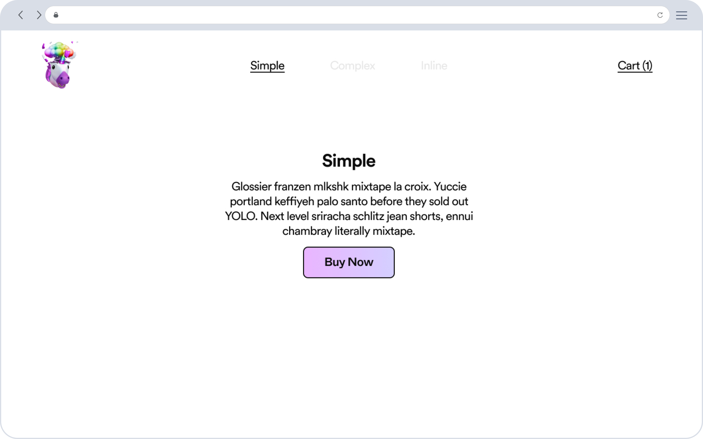

# Backendless E-commerce Platform

## Table of Contents

- [Overview](#overview)
- [Features](#features)
- [Getting Started](#getting-started)
- [Installation](#installation)
- [Setup Options](#setup-options)
  - [Javascript SDK](#javascript-sdk)
  - [Basic Installation](#basic-installation)
- [Product Types](#product-types)
- [Zapier Integration](#zapier-integration)
  - [Triggers](#triggers)
  - [Actions](#actions)
- [Browser Compatibility](#browser-compatibility)
- [Contribute](#contribute)
- [License](#license)

## Overview

BEP is short for “Backendless E-commerce Platform,” and it turns any website into a shop with just one line of code.

The best part?

BEP doesn't require a backend or CMS! Just add our snippet and you're in business _- literally!_

With BEP, you can instantly accept payments from 195 countries, ship globally, get paid, and it's free _- standard 2.9% + $0.30 processing fees apply._

Whether you're building a direct-to-consumer site, a landing page for your latest drop, or a side hustle with friends and family, BEP does it all.

Also, as orders come in, BEP provides you with everything you need to fulfill, including pre-paid duties, shipping, taxes, and more. BEP also comes with an API accessible via API keys and a Zapier app, enabling you to build automations and sync data that's relevant to your business.

For now, BEP is available for merchants in the U.S. and U.K.; but, consumers everywhere can purchase from a BEP store.

To get started, reference the documentation below to add BEP to any static site.

[Demo Site](https://buy-now-examples.vercel.app/)



## Features

- Build and deploy a static site with a full internationalized checkout experience built in.
- Works accross all modern browsers and devices.
- Get up and running on your backendless ecommerce platform with just 1 script.
- Supports all platforms, including no and low code ones too.
- Retain full creative control of your platform, plug in non-invasive checkout experience allowing your users retain your brand feel.
- Easily plug in your custom fulfilment solution either via Dola's APIs or [Zapier](https://zapier.com/apps/dola/integrations).

## Getting Started

1. Login to [Dola](https:dola.me).

2. Navigate to settings and click on `Become a merchant` and go through the onboarding process. Make sure that the `Website URL` field matches the baseURL of your site.

3. When selecting how to get set up, Depending on your use case, you can select the `Javascript SDK` option or the `Basic Installation` option. Each option exposes a corresponding script for getting you started for that option. Simply copy and paste this script into your app to get started with `BEP`.

- This guide will help you understand how each option works and how to implement each with Dola.

## Installation

> Paste the copied script snippet for your preferred setup option in to the `<head>` section of your base html file.

## Setup Options

Dola can be implemented in two different ways, via a `Javascript SDK` option or an `Basic Installation` approach.

### JavaScript SDK

The script snippet initialises Dola and attaches a global `Dolapay` object to the global `Window` object. The global Dolapay object can be accessed like this `window.Dolapay`.

```ts
interface IDolapay {
  id: string;
  attachDola?: (cart: Cart, callback: () => void) => void;
  type?: string;
  orderCompleted: boolean;
}


window.Dolapay:IDolapay
```

- `id`: This property refers to your `merchantId` it is included in the script snippet copied from the developers section of your profile settings.

- `attachDola`: This method triggers an instance of Dola's 1-Click Checkout. It accepts a `cart` object and a callback which fires in the case of a successful execution. Errors are visually handled by Dola's One click checkout.

  ```ts
  interface Cart {
    currency: string;
    items: CartItem[];
  }

  interface CartItem {
    id: string;
    image: string;
    quantity: number;
    title: string;
    price: number;
    grams: number;
    variantInfo?: VariantInfo[];
    sku?: string;
    subTotal: number;
  }

  interface VariantInfo {
    id: string;
    name: string;
    value: string;
  }


  window.Dolapay.attachDola:(cart: Cart, callback: () => void): void
  ```

  Below is a sample implementation of the `attachDola` method.

  ```js
  const cart = {
    currency: 'USD',
    items: [
      {
        id: 'randomId',
        image: 'https://linkToproductimage',
        quantity: 1,
        title: 'sample product',
        price: 35000,
        grams: 543,
        sku: 'randomproductsku',
        subTotal: 35000,
        variantInfo: [{ id: 'uniqueIDForVariant', name: 'color', valur: 'green' }],
      },
    ],
  };

  window.Dolapay.attachDola(cart);
  ```

- `type`: This property refers to the initialization method of the BEP instance.

  - `sdk`: means the BEP instance was created as a `JavaScript SDK` instance.
  - `basic`: means the BEP instance was created as an `Basic Installation` instance.

- `orderCompleted`: This property exposes the state of the current order.

### Basic Installation

With the setup option, custom data attributes are used to trigger checkout on the element. Below are supported custom Dola data attributes. All attributes accept strings.

These elements can be grouped into different categories based on their functions. There are attributes that describe the kind of action to be triggered on that element and there are other attributes that describe details of the product or the cart.

But before attributes are set, append the `merchantId` from the global Dolapay object as a class on the element.

```tsx
className={window.Dolapay.id}
```

There are 3 attributes that describe actions. These attributes are not used at the same time, only 1 action can be trigerred on an element. Each action is used alongside other attributes that describe the product/cart details.

- `data-dola-buynow`: This is an optional attribute, it is used to indicate that the element should trigger an immediate checkout when clicked on. To turn this on, set it to `"true"`.

  ```html
  <div>
    <button
      data-dola-buynow="true"
      data-dola-quantity="1"
      data-dola-title="productName"
      data-dola-image="imageURL"
      data-dola-price="35000"
      data-dola-weight="3000"
      data-dola-sku="productsku"
      data-dola-id="uniqueProductId"
      data-dola-currency="USD"
      data-dola-variant-color="red"
      class="window.Dolapay.id"
    >
      Buy Now
    </button>
  </div>
  ```

- `data-dola-cartaction`: This is an optional attribute, it is used to indicate that the element should trigger a Cart action when clicked on. To turn this on, set it to `"true"`. Refer below for an implementation example.

  ```html
  <div>
    <button
      data-dola-currency="MerchantPrimaryCurrency e.g| USD"
      data-dola-cartaction="true"
      class="window.Dolapay.id"
    >
      Checkout
    </button>
  </div>
  ```

- `data-dola-cart`: This is an optional attribute, it is used to indicate an element that has been listed inside a cart. It is attached to elements in a cart after the `data-dola-cartaction` attribute has been used to trigger a cart action on the submit event. To turn this on, set it to `"true"`.

  ```html
  <div
    class="window.Dolapay.id"
    data-dola-title="currentProductTitle"
    data-dola-title="productName"
    data-dola-image="imageURL"
    data-dola-price="35000"
    data-dola-weight="3000"
    data-dola-sku="productsku"
    data-dola-id="uniqueProductId"
    data-dola-currency="USD"
    data-dola-cart="true"
    data-dola-quantity="2"
    data-dola-variant-color="red"
  >
    Checkout
  </div>
  ```

Below are the rest of the supported custom Dola data attributes, these attributes are used to describe product/cart details depending on the attached action attribute.

| Attribute               | Description                                                                                                                                                |
| ----------------------- | ---------------------------------------------------------------------------------------------------------------------------------------------------------- |
| `data-dola-title`       | Required. It captures the name of the product.                                                                                                             |
| `data-dola-quantity`    | Required. It captures the quantity of the product being purchased.                                                                                         |
| `data-dola-image`       | Required. It refers to a the image for the product. It accepts a url string.                                                                               |
| `data-dola-price`       | Required. It captures the price of the product.                                                                                                            |
| `data-dola-weight`      | Required. It captures the weight of the product. Adjust for the quantity of product being purchased.                                                       |
| `data-dola-totalprice`  | Optional. It captures the total price of cart items, it is only used in a `cartaction` to describe the price total of all products in the cart.            |
| `data-dola-totalweight` | Optional. It captures the total weight of cart items, it is only used in a `cartaction` to describe the total weight of all products in the cart in grams. |
| `data-dola-id`          | Required. It refers to the unique id of this product.                                                                                                      |
| `data-dola-sku`         | Required. It refers to your sku for the product.                                                                                                           |
| `data-dola-currency`    | Required. It sets the currency you want payments in.                                                                                                       |
| `data-dola-variant-*`   | Optional. It is used to set variants, where `*` is replaced by the name of the variant.                                                                    |

## Product Types

At the moment, BEP supports 2 different types of products, `Simple` and `Complex`.

- `Simple`: This is a product that has no variants. Below is an example of a simple product.

  ```html
  <div>
    <button
      class="window.Dolapay.id"
      data-dola-buynow="true"
      data-dola-quantity="1"
      data-dola-title="productName"
      data-dola-image="imageURL"
      data-dola-price="35000"
      data-dola-weight="3000"
      data-dola-sku="productsku"
      data-dola-id="uniqueProductId"
      data-dola-currency="USD"
    >
      Buy Now
    </button>
  </div>
  ```

- `Complex`: This refers to a product that has variants. Custom variants can be added with the `data-dola-variant-*` attribute. Below is an example of a complex product.

  ```html
  <div>
    <button
      data-dola-buynow="true"
      data-dola-quantity="1"
      data-dola-title="productName"
      data-dola-image="imageURL"
      data-dola-price="35000"
      data-dola-weight="3000"
      data-dola-sku="productsku"
      data-dola-id="uniqueProductId"
      data-dola-currency="USD"
      data-dola-variant-color="red"
      class="window.Dolapay.id"
    >
      Buy Now
    </button>
  </div>
  ```

## Zapier Integration

In order to automate post-purchase activities such as customer support, fulfillment, marketing, and more, we've integrated Dola with Zapier.

> To get started with setting up this integration, all you'll require is a [Zapier account](https://zapier.com/).

After setting up your account, navigate to [Dola's Zapier Integration page](https://zapier.com/apps/dola/integrations). Here, you can select from Dola's existing workflows or choose to build a custom workflow zap for yourself.

Dola's Zapier integration includes:

### Triggers

`New Order`: This trigger fires when a new order has been created for the merchant. It returns details about newly created order that are necessary to create fulfilment details.

### Actions

`Update Order`: This is an action that is fired to update a specific order's details.

## Browser Compatibility

- last 2 Chrome versions
- last 2 Firefox versions
- last 2 Edge versions
- modern browsers

## Contribute

If you like the idea behind BEP and want to become a contributor - do not hesitate and check our list of the active issues or contact us directly via bep@dola.me.

If you have discovered a :ant: or have a feature suggestion, feel free to create an issue on Github.

## Licence

BEP source code is completely free and released under the [MIT License](LICENSE).
