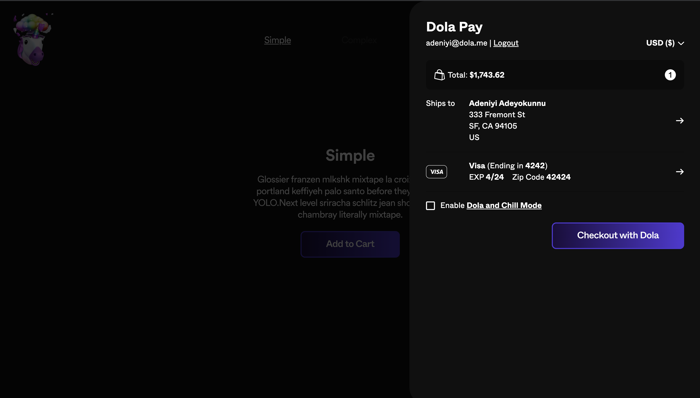

# Dola Buy Now

This is Dola's Buy Now button, tentatively called "Now", it enables you transform any HTML element into a shoppable product, or storefront (i.e multiple Buy Now buttons on a single page), with a 1-click checkout. This is done through an on-click function, this repository holds the code, and below is documentation for integrating with your static site. For a demo of the buy now in action, checkout the [Buy now example site](https://buy-now-examples.vercel.app/).



## Features

- Build and deploy a static site with a full internationalized checkout experience built in.

- Works accross all modern browsers and devices.
- Get up and running on your backendless ecommerce platform with just 1 script.
- Supports no-code/ low-code platforms.
- Retain full creative control of your platform, plug in non-invasive checkout experience allowing your users retain your brand feel.

## Getting Started

1. Login to [Dola](https:dola.me).

2. Navigate to settings and click on `Become a merchant` and go through the onboarding process. make sure that the `websiteURL` field matches the baseURL of your site.\*

3. When selecting how to get set up, Depending on your use case, you can select the `Javascript SDK` option or the `HTML Attributes` option. Each option exposes a corresponding script for getting you started for that option. simply copy and paste this script into your app to get started with `Now`;

- This guide will help you understand how each option works and how to implement each with Dola.\*

## Installation

> Paste the copied script snippet for your preferred setup option in to the `<head>` section of your base html file.

## Set up Options

Dola can be implemented in two different ways, via a `Javascript SDK` option or an `HTML Attributes` approach.

### JavaScript SDK

The script snippet initialises Dola and attaches a global `Dolapay` object to the global `Window` object. The global Dolapay object can be accessed like this `window.Dolapay`.

```ts
interface IDolapay {
  id: string;
  attachDola?: (cart: Cart, callback: () => void) => void;
  type?: string;
  orderCompleted: boolean;
}


window.Dolapay:IDolapay
```

- `id`: This property refers to your `merchantId` it is included in the script snippet copied from the developers section of your profile settings.

- `attachDola`: This method triggers an instance of Dola's 1-Click Checkout. It accepts a `cart` object and a callback which fires in the case of a successful execution. Errors are visually handled by Dola's One click checkout.

  ```ts
  interface Cart {
    totalPrice: number;
    totalWeight: number;
    currency: string;
    items: CartItem[];
  }

  interface CartItem {
    id: string;
    image: string;
    quantity: number;
    title: string;
    price: number;
    grams: number;
    variantInfo?: VariantInfo[];
    sku?: string;
    subTotal: number;
  }

  interface VariantInfo {
    id: string;
    name: string;
    value: string;
  }


  window.Dolapay.attachDola:(cart: Cart, callback: () => void): void
  ```

  Below is a sample implementation of the `attachDola` method.

  ```js
  const cart = {
    totalPrice: 35000,
    totalWeight: 543,
    currency: 'USD',
    items: [
      {
        id: 'randomId',
        image: 'https://linkToproductimage',
        quantity: 1,
        title: 'sample product',
        price: 35000,
        grams: 543,
        sku: 'randomproductsku',
        subTotal: 35000,
        variantInfo: [{ id: 'uniqueIDForVariant', name: 'color', valur: 'green' }],
      },
    ],
  };

  window.Dolapay.attachDola(cart);
  ```

- `type`: This property refers to the initialization method of the Buy Now instance.

  - `basic`: means the Buy Now instance was created as a `JavaScript SDK` instance.
  - `custom`: means the Buy Now instance was created as an `HTML Attributes` instance.

- `orderCompleted`: This property exposes the state of the current order.

### HTML Attributes

With the setup option, custom data attributes are used to trigger checkout on the element. Below are supported custom dola data attributes. All attributes accept strings.

These elements can be grouped into different categories based on their functions. There are attributes that describe the kind of action to be triggered on that element and there are other attributes that describe details of the product or the cart.

But before attributes are set, append the `merchantId` from the global Dolapay object as a class on the element.

```tsx
className={window.Dolapay.id}
```

There are 3 attributes that describe actions. These attributes are not used at the same time, only 1 action can be trigerred on an element. Each action is used alongside other attributes that describe the product/cart details.

- `data-dola-buynow`: This is an optional attribute, it is used to indicate that the element should trigger an immediate checkout when clicked on. To turn this on, set it to `"true"`.

  ```html
  <div>
    <button
      data-dola-buynow="true"
      data-dola-quantity="1"
      data-dola-title="productName"
      data-dola-image="imageURL"
      data-dola-price="35000"
      data-dola-weight="3000"
      data-dola-sku="productsku"
      data-dola-id="uniqueProductId"
      data-dola-currency="USD"
      data-dola-variant-color="red"
      className="window.Dolapay.id"
    >
      Buy Now
    </button>
  </div>
  ```

- `data-dola-cartaction`: This is an optional attribute, it is used to indicate that the element should trigger a Cart action when clicked on. To turn this on, set it to `"true"`. Refer below for an implementation example.

  ```html
  <div>
    <button
      data-dola-totalprice="totalCartTotal"
      data-dola-totalweight="totalCartWeight"
      data-dola-currency="MerchantPrimaryCurrency e.g| USD"
      data-dola-cartaction="true"
      className="window.Dolapay.id"
    >
      Checkout
    </button>
  </div>
  ```

- `data-dola-cart`: This is an optional attribute, it is used to indicate an element that has been listed inside a cart. it is attached to elements in a cart after the `data-dola-cartaction` attribute has been used to trigger a cart action on the submit event. To turn this on, set it to `"true"`.

  ```html
  <div
    className="window.Dolapay.id"
    data-dola-title="currentProductTitle"
    data-dola-title="productName"
    data-dola-image="imageURL"
    data-dola-price="35000"
    data-dola-weight="3000"
    data-dola-sku="productsku"
    data-dola-id="uniqueProductId"
    data-dola-currency="USD"
    data-dola-cart="true"
    data-dola-quantity="2"
    data-dola-variant-color="red"
  >
    Checkout
  </div>
  ```

Below are the rest of the supported custom dola data attributes, these attributes are used to describe product/cart details depending on the attached action attribute.

- `data-dola-title`: This is a required attribute, it captures the name of the product.
- `data-dola-quantity`: This is a required attribute, it captures the quantity of the product being purchased.
- `data-dola-image`: This is a required attribute, it refers to a the image for the product. It accepts a url.
- `data-dola-price`: This is a required attribute, it captures the price of the product.
- `data-dola-weight`: This is a required attribute, it captures the weight of the product. Adjust for the quantity of product being purchased.
- `data-dola-totalprice`: This is an optional attribute, it captures the total price of cart items, it is only used in a `cartaction` to describe the price total of all products in the cart.
- `data-dola-totalweight`: This is an optional attribute, it captures the total weight of cart items, it is only used in a `cartaction` to describe the total weight of all products in the cart in grams.
- `data-dola-id`: This is a required attribute, it refers to the unique id of this product.
- `data-dola-sku`: This is a required attribute, it refers to your sku for the product.
- `data-dola-currency`: This is a required attribute, it sets the currency you want payments in.
- `data-dola-variant-*`: This is an optional attribute, it is used to set variants, where `*` is replaced by the name of the variant.

## Product Types

At the moment, the Buy now supports 2 different types of products, `Simple` and `Complex`.

- `Simple`: This is a product that has no variants. Below is an example of a simple product.

  ```html
  <div>
    <button
      className="{window.Dolapay.id}"
      data-dola-buynow="true"
      data-dola-quantity="1"
      data-dola-title="productName"
      data-dola-image="imageURL"
      data-dola-price="35000"
      data-dola-weight="3000"
      data-dola-sku="productsku"
      data-dola-id="uniqueProductId"
      data-dola-currency="USD"
    >
      Buy Now
    </button>
  </div>
  ```

- `Complex`: This refers to a product that has variants. Custom variants can be added with the `data-dola-variant-*` attribute. Below is an example of a complex product.

  ```html
  <div>
    <button
      data-dola-buynow="true"
      data-dola-quantity="1"
      data-dola-title="productName"
      data-dola-image="imageURL"
      data-dola-price="35000"
      data-dola-weight="3000"
      data-dola-sku="productsku"
      data-dola-id="uniqueProductId"
      data-dola-currency="USD"
      data-dola-variant-color="red"
      className="window.Dolapay.id"
    >
      Buy Now
    </button>
  </div>
  ```

  ## Licence

  This project is served with MIT's Open source licence.
